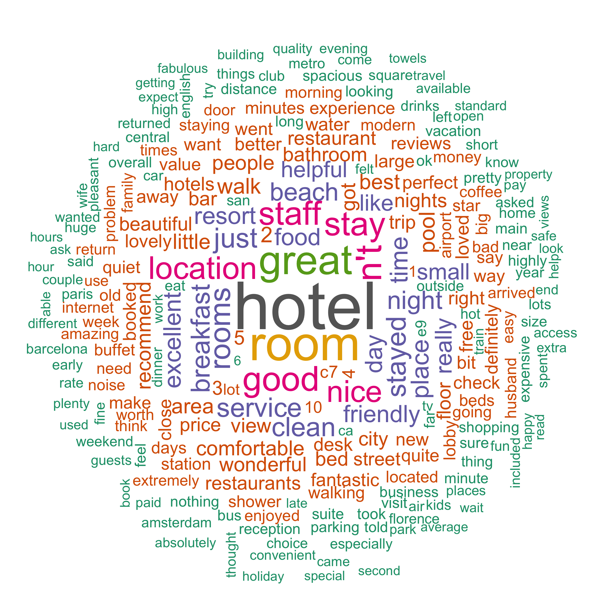
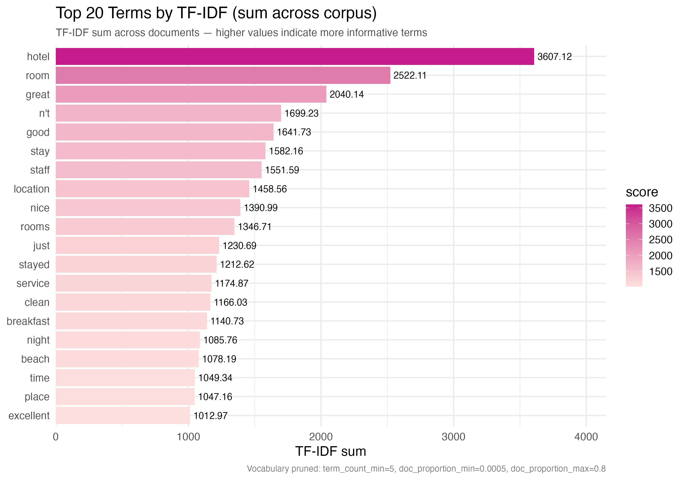
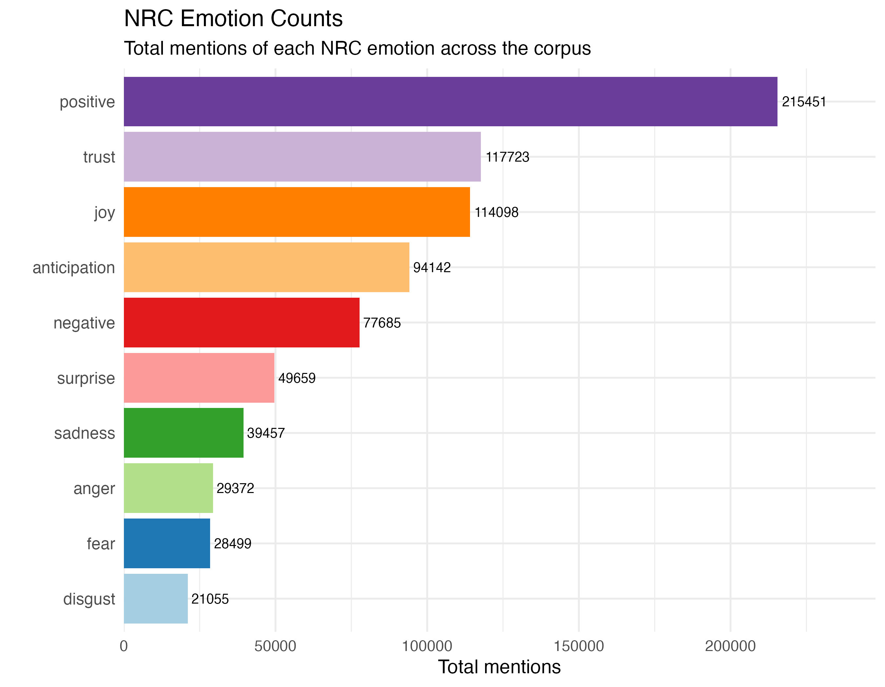
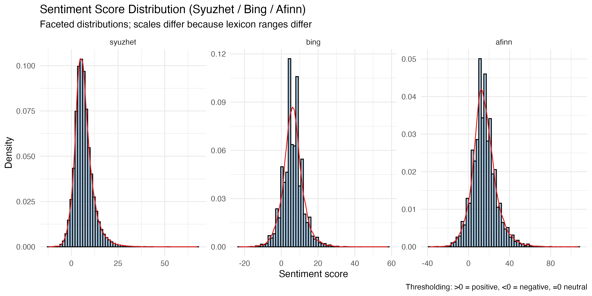
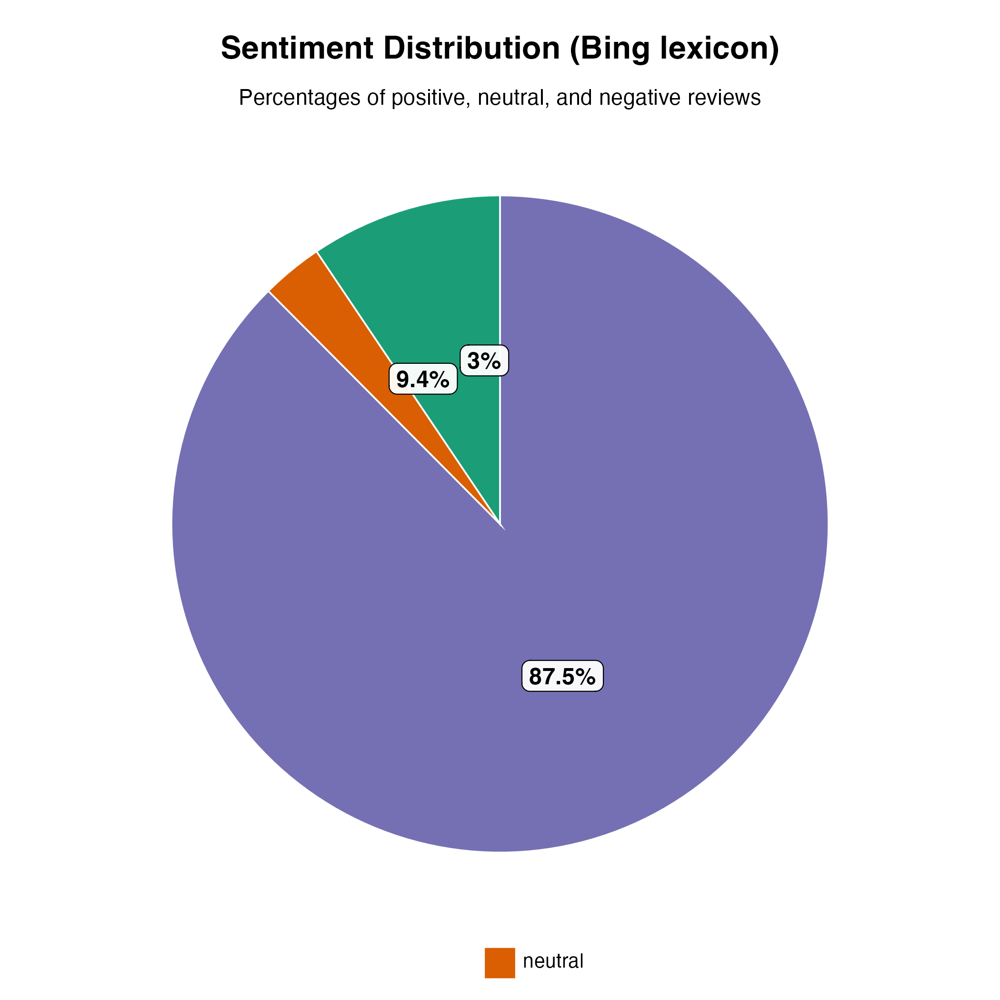

# Sentiment Analysis on Customer Reviews in R

[](https://www.r-project.org/) [](https://opensource.org/licenses/MIT) [](https://cran.r-project.org/web/packages/text2vec/) [](https://cran.r-project.org/web/packages/caret/)

---

## Overview

This project performs **sentiment analysis on TripAdvisor hotel reviews** using **Machine Learning and Lexicon-based techniques in R**.

It combines **lexicon-based sentiment extraction** (`syuzhet`, `bing`, `afinn`) with a **supervised TF-IDF + GLMNET classifier**, built using the `text2vec` and `caret` frameworks.

---

## Features

* Text preprocessing and TF-IDF vectorization using **text2vec**
* Lexicon-based sentiment scoring using **Syuzhet**, **Bing**, **Afinn**
* Emotion analysis using **NRC lexicon**
* Supervised model training using **Logistic Regression (GLMNET)**
* Model evaluation using **caret** and **pROC**
* Reproducible dependency management with **renv**

---

## Project Structure

```
aspa-sentiment-r/
├── data/                       # Dataset (20,491 TripAdvisor reviews)
├── scripts/                    # R scripts for analysis
│   ├── 00_project_setup.R
│   ├── 01_exploratory_sentiment.R
│   └── 02_supervised_sentiment_model.R
├── figures/                    # Generated figures
│   ├── wordcloud_text2vec.png
│   ├── top_terms_tfidf_top20.png
│   ├── nrc_emotion_counts.png
│   ├── sentiment_hist_lexicons.png
│   └── sentiment_distribution_bing.png
├── models/                     # Vocabulary, TF-IDF transformer, model
├── reports/                    # CSV outputs and samples
├── renv.lock                   # Dependencies snapshot
└── aspa-sentiment-r.Rproj
```

---

## Visual Results

### 1. Word Cloud — Top Frequent & Informative Terms


*Visualization of the most prominent terms by TF-IDF score.*

---

### 2. Top 20 Terms by TF-IDF


*High-weight words that contribute most to the sentiment model.*

---

### 3. Emotion Breakdown (NRC Lexicon)


*Distribution of emotional categories such as joy, trust, sadness, anger, etc.*

---

### 4. Sentiment Score Distributions (Lexicon Comparison)


*Comparative sentiment score ranges across Syuzhet, Bing, and Afinn lexicons.*

---

### 5. Sentiment Distribution (Pie Chart)


*Proportion of positive, neutral, and negative sentiments based on Bing lexicon.*

---

## Model Performance Summary

| Metric          | Value      | Description                           |
| --------------- | ---------- | ------------------------------------- |
| **Accuracy**    | **94.6%**  | Overall classification accuracy       |
| **AUC (ROC)**   | **0.9836** | Excellent discrimination ability      |
| **Sensitivity** | **98.6%**  | Correctly detects positive sentiments |
| **Specificity** | **75.3%**  | Correctly detects negative sentiments |
| **Kappa**       | **0.798**  | Strong agreement beyond chance        |

The model shows **outstanding predictive performance**, demonstrating the power of **TF-IDF + GLMNET** for textual sentiment classification.

---

## Setup Instructions

1. Clone the repository:

   ```bash
   git clone https://github.com/Ash-the-k/aspa-sentiment-r
   cd aspa-sentiment-r
   ```

2. Open the project in RStudio.

3. Restore dependencies (like `pip install -r requirements.txt` in Python):

   ```r
   install.packages("renv")
   renv::restore()
   ```

4. Run the analysis scripts:

   ```r
   source("scripts/01_exploratory_sentiment.R")
   source("scripts/02_supervised_sentiment_model.R")
   ```

All visualizations will be generated in the `figures/` folder, and results in `reports/`.

---

## Methodology Summary

1. **Data Cleaning:** Removal of punctuation, symbols, and stopwords.
2. **TF-IDF Construction:** Sparse document-term matrix creation via `text2vec`.
3. **Exploratory Lexicon Analysis:** Sentiment and emotion extraction using `syuzhet` and NRC.
4. **Supervised Model Training:** Logistic Regression (`glmnet`) trained on TF-IDF features.
5. **Evaluation:** Confusion matrix, accuracy, and ROC-AUC metrics.

---

## Conclusion

This project demonstrates an **end-to-end sentiment analysis workflow** in R, integrating both **descriptive (lexicon)** and **predictive (machine learning)** approaches. It can serve as a reproducible template for future NLP applications in R.

---

## License

This project is shared under the **MIT License** — free to use, modify, and distribute with attribution.
